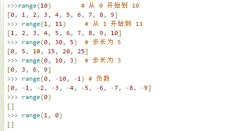
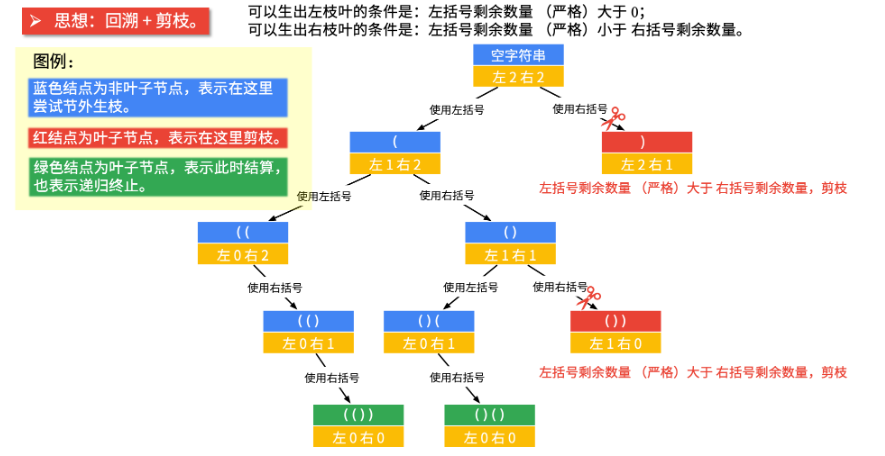
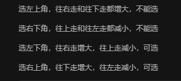
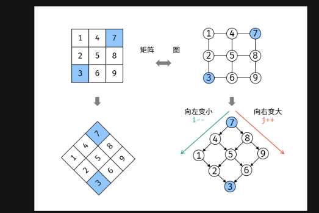
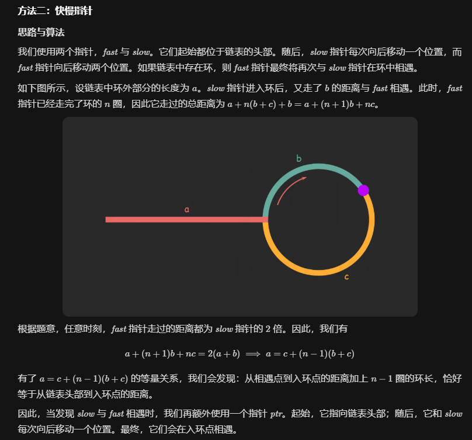
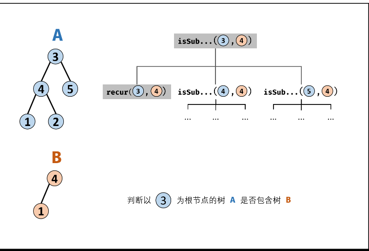
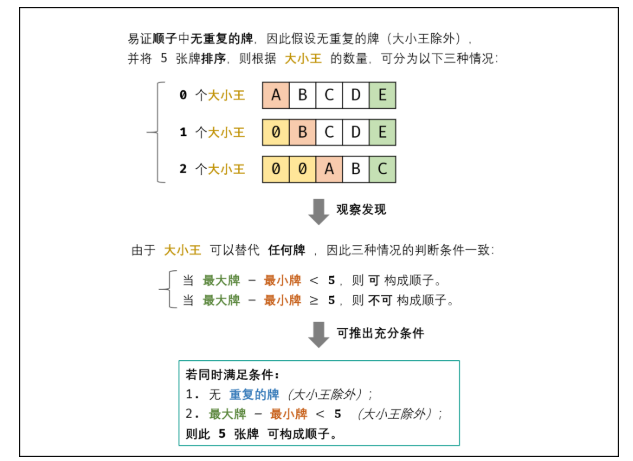
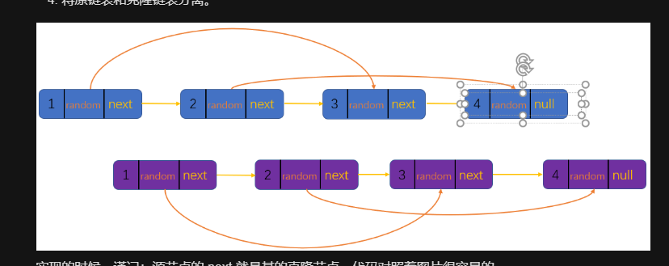

## 12.7

#### [861. 翻转矩阵后的得分](https://leetcode-cn.com/problems/score-after-flipping-matrix/)

实际是一道贪心的题，只要反转的数量确定，具体的反转过程可以不同

#### [416. 分割等和子集](https://leetcode-cn.com/problems/partition-equal-subset-sum/)

01背包问题的改进版本

## 12.8

#### [474. 一和零](https://leetcode-cn.com/problems/ones-and-zeroes/)

动态规划问题

对range（）的控制范围还不太熟悉



#### [743. 网络延迟时间](https://leetcode-cn.com/problems/network-delay-time/)

图的最短路径问题，提交记录中的python时间复杂度还可以按照最小堆去优化

#### [167. 两数之和 II - 输入有序数组](https://leetcode-cn.com/problems/two-sum-ii-input-array-is-sorted/)

双指针

利用双指针可以O(N)的时间复杂度，并且空间复杂度O(1)（这个是从两边往中间走的）  yejiao

#### [844. 比较含退格的字符串](https://leetcode-cn.com/problems/backspace-string-compare/)

方法一比较容易想到

方法二是从两个字符串的尾巴往前走（还没有仔细看）

#### [977. 有序数组的平方](https://leetcode-cn.com/problems/squares-of-a-sorted-array/)

官方题解的方法三写的比自己的简单

#### [面试题 10.01. 合并排序的数组](https://leetcode-cn.com/problems/sorted-merge-lcci/)

题解答案更简单 ， while 循环里面再加循环容易陷进去

## 12.9

#### [面试题 02.02. 返回倒数第 k 个节点](https://leetcode-cn.com/problems/kth-node-from-end-of-list-lcci/)

双指针 一个先走 一个慢走

#### [62. 不同路径](https://leetcode-cn.com/problems/unique-paths/)

动态规划的模板题吧  ，主要是分析当前位置能由哪些位置得来

#### [69. x 的平方根](https://leetcode-cn.com/problems/sqrtx/)

利用二分查找可以很快的找到

#### [53. 最大子序和](https://leetcode-cn.com/problems/maximum-subarray/)

动态规划问题，数量级在O(N)

类似的还有 区间最长连续上升序列问题，区间最大子段和问题

#### [22. 括号生成](https://leetcode-cn.com/problems/generate-parentheses/)

回溯法，只是在动作选择那里还需要对动作的有效性做判断，然后就可以跟模板对上了，官方题解省去了动作选择的过程。 因为本题这里可以选择的动作集合一是都是[ "(" , ")"] 。

```python
# 官方题解
class Solution:
    def generateParenthesis(self, n: int) -> List[str]:
        ans = []
        def backtrack(S, left, right):
            if len(S) == 2 * n:
                ans.append(''.join(S))
                return
            # 省去了动作选择过程，直接就是对动作选择的有效性判断。
            if left < n:
                S.append('(')
                backtrack(S, left+1, right)
                S.pop()
            if right < left:
                S.append(')')
                backtrack(S, left, right+1)
                S.pop()

        backtrack([], 0, 0)
        return ans
 
```




##  12.10

#### [860. 柠檬水找零](https://leetcode-cn.com/problems/lemonade-change/)

贪心找零钱法

#### [剑指 Offer 06. 从尾到头打印链表](https://leetcode-cn.com/problems/cong-wei-dao-tou-da-yin-lian-biao-lcof/)

递归的运用

#### [剑指 Offer 15. 二进制中1的个数](https://leetcode-cn.com/problems/er-jin-zhi-zhong-1de-ge-shu-lcof/)

n &= n - 1的运用

```mysql
class Solution:
    def hammingWeight(self, n: int) -> int:
        res = 0
        while n:
            res += 1
            n &= n - 1
            print(n)
        return res
```

## 12.11

#### [剑指 Offer 05. 替换空格](https://leetcode-cn.com/problems/ti-huan-kong-ge-lcof/)

字符串的拼接

#### [剑指 Offer 57 - II. 和为s的连续正数序列](https://leetcode-cn.com/problems/he-wei-sde-lian-xu-zheng-shu-xu-lie-lcof/)

双指针移动，都是从同一边开始的

#### [剑指 Offer 58 - I. 翻转单词顺序](https://leetcode-cn.com/problems/fan-zhuan-dan-ci-shun-xu-lcof/)

可以倒序进行连续字符串的判断，这样就少了一个反转的过程

#### [剑指 Offer 57. 和为s的两个数字](https://leetcode-cn.com/problems/he-wei-sde-liang-ge-shu-zi-lcof/)

这道题和之前的167是一样的，自己又忘记了，应该是双指针，从两边往中间走

#### [剑指 Offer 50. 第一个只出现一次的字符](https://leetcode-cn.com/problems/di-yi-ge-zhi-chu-xian-yi-ci-de-zi-fu-lcof/)

这道题主要考有序哈希表，在java中有序哈希，是LinkedHashMap

```java
Map<Character, Boolean> dic = new LinkedHashMap<>();
```

python写法

```python
class Solution:
    def firstUniqChar(self, s: str) -> str:
        dic = collections.OrderedDict()
        for c in s:
            dic[c] = not c in dic
        for k, v in dic.items():
            if v: return k
        return ' '
```

## 11.12

#### [剑指 Offer 21. 调整数组顺序使奇数位于偶数前面](https://leetcode-cn.com/problems/diao-zheng-shu-zu-shun-xu-shi-qi-shu-wei-yu-ou-shu-qian-mian-lcof/)

双指针移动， 像冒泡排序，选择排序问题。[这个题解有动画，方便理解](https://leetcode-cn.com/problems/diao-zheng-shu-zu-shun-xu-shi-qi-shu-wei-yu-ou-shu-qian-mian-lcof/solution/ti-jie-shou-wei-shuang-zhi-zhen-kuai-man-shuang-zh/)

#### [283. 移动零](https://leetcode-cn.com/problems/move-zeroes/)

双指针移动

#### [75. 颜色分类](https://leetcode-cn.com/problems/sort-colors/)

相当于简化的快排，再一次没做出来

```python
class Solution:
    def sortColors(self, nums: List[int]) -> None:
        """
        Do not return anything, modify nums in-place instead.
        """
        left = 0
        right =len(nums) - 1
        i = 0 
        while i <= right :
            if nums[i]  == 0 :
                temp = nums[i]
                nums[i] = nums[left] 
                
                nums[left] = temp 
                left += 1
            elif nums[i] == 2 :
                temp = nums[i]
                nums[i] = nums[right] 
                i -= 1           #  特别的地方 相当于交换2之后   i又复归原位了
                nums[right] = temp 
                right -= 1
            i += 1
```

#### [343. 整数拆分](https://leetcode-cn.com/problems/integer-break/)

n平方的时间复杂度的动态规划   

#### [50. Pow(x, n) ](https://leetcode-cn.com/problems/powx-n/) 

这道题主要考**快速幂等**的做法    用到了分而治之的想法   

## 12.14

#### [49. 字母异位词分组](https://leetcode-cn.com/problems/group-anagrams/)

想法容易想，就是java比较难写

```python
class Solution:
    def groupAnagrams(self, strs: List[str]) -> List[List[str]]:
        mp = collections.defaultdict(list)

        for st in strs:
            counts = [0] * 26
            for ch in st:
                counts[ord(ch) - ord("a")] += 1
            # 需要将 list 转换成 tuple 才能进行哈希
            mp[tuple(counts)].append(st)
        
        return list(mp.values())
```

```java
// 以String 为键
class Solution {
    public List<List<String>> groupAnagrams(String[] strs) {
        Map<String, List<String>> map = new HashMap<String, List<String>>();
        for (String str : strs) {
            int[] counts = new int[26];
            int length = str.length();
            for (int i = 0; i < length; i++) {
                counts[str.charAt(i) - 'a']++;
            }
            // 将每个出现次数大于 0 的字母和出现次数按顺序拼接成字符串，作为哈希表的键
            StringBuffer sb = new StringBuffer();
            for (int i = 0; i < 26; i++) {
                if (counts[i] != 0) {
                    sb.append((char) ('a' + i));
                    sb.append(counts[i]);
                }
            }
            String key = sb.toString();
            List<String> list = map.getOrDefault(key, new ArrayList<String>());
            list.add(str);
            map.put(key, list);
        }
        return new ArrayList<List<String>>(map.values());
    }
}
```

## 12.15

#### [153. 寻找旋转排序数组中的最小值](https://leetcode-cn.com/problems/find-minimum-in-rotated-sorted-array/)

在左右两边判断那里

#### [738. 单调递增的数字](https://leetcode-cn.com/problems/monotone-increasing-digits/)

抄的答案 贪心思想

#### [剑指 Offer 53 - II. 0～n-1中缺失的数字](https://leetcode-cn.com/problems/que-shi-de-shu-zi-lcof/)

输入写成这种更容易理解一点     [0,1,2,3,4,5,6,7,9,10,11,12] 想到于找到断界的地方

[[278. 第一个错误的版本](https://leetcode-cn.com/problems/first-bad-version/)](https://leetcode-cn.com/problems/first-bad-version/)

跟剑指offer 53的内容是一样的

```python
class Solution:
    def firstBadVersion(self, n):
        left = 1
        right = n
        while left <= right :
            mid = left + ( right - left )  //2
            if isBadVersion(  mid  ) :  
                right = mid - 1  
            else:  
                left = mid +1  
        return left  
```

```python
class Solution:
    def firstBadVersion(self, n):
        left = 1
        right = n
        while left < right :                          #  注意跟上面的区别
            mid = left + ( right - left )  //2  
            if isBadVersion(  mid  ) :    
                right = mid   
            else:  
                left = mid +1 
        return left  
```

## 12.16

#### [剑指 Offer 14- I. 剪绳子](https://leetcode-cn.com/problems/jian-sheng-zi-lcof/)

动态规划问题

也可以贪心去做，尽可能划分成多的长度为3的线段

#### [剑指 Offer 16. 数值的整数次方](https://leetcode-cn.com/problems/shu-zhi-de-zheng-shu-ci-fang-lcof/)

分而治之的想法

#### [剑指 Offer 18. 删除链表的节点](https://leetcode-cn.com/problems/shan-chu-lian-biao-de-jie-dian-lcof/)

#### [剑指 Offer 04. 二维数组中的查找](https://leetcode-cn.com/problems/er-wei-shu-zu-zhong-de-cha-zhao-lcof/)

[通过转换可以把二维数组变成一个二叉搜索树](https://leetcode-cn.com/problems/er-wei-shu-zu-zhong-de-cha-zhao-lcof/solution/mian-shi-ti-04-er-wei-shu-zu-zhong-de-cha-zhao-zuo/)



[里面也有二分查找的想法](https://leetcode-cn.com/problems/er-wei-shu-zu-zhong-de-cha-zhao-lcof/solution/jian-er-zhi-zhi-er-fen-cha-zhao-by-liweiwei1419-3/)

二维数组的查找，但时间复杂度是O(m+n)  ，实际这道题除了左上角还有右小角可以选择

#### [剑指 Offer 53 - I. 在排序数组中查找数字 I](https://leetcode-cn.com/problems/zai-pai-xu-shu-zu-zhong-cha-zhao-shu-zi-lcof/)    统计一个数字在排序数组中出现的次数。

这道题一般的想法就是找到该数的左右边界 然后再做差

#### [剑指 Offer 57. 和为s的两个数字](https://leetcode-cn.com/problems/he-wei-sde-liang-ge-shu-zi-lcof/)

对撞双指针（也就是指针中数组的两边往中间走）的时间复杂度是O(n) ， 但遍历加二分查找最坏情况下  就是O(n*logn)

#### [剑指 Offer 03. 数组中重复的数字](https://leetcode-cn.com/problems/shu-zu-zhong-zhong-fu-de-shu-zi-lcof/)

原地置换，如果坑被占了，说明有重复的数字（一个萝卜一个坑）

[四种做法](https://leetcode-cn.com/problems/shu-zu-zhong-zhong-fu-de-shu-zi-lcof/solution/java-de-4chong-jie-fa-by-sdwwld/)

#### [136. 只出现一次的数字](https://leetcode-cn.com/problems/single-number/)

经典的异或解法（或者叫做位运算做法）

#### [141. 环形链表](https://leetcode-cn.com/problems/linked-list-cycle/)

#### [142. 环形链表 II](https://leetcode-cn.com/problems/linked-list-cycle-ii/)

实际是通过公式计算出来的，因此才会在链表开始重新走一个指针



#### [287. 寻找重复数](https://leetcode-cn.com/problems/find-the-duplicate-number/)  

287题要用到  142环形链表2的快慢指针思想  并且程序也要转换一下写法 ，把数组当做一个链表那样的索引

[双指针题解在这里](https://leetcode-cn.com/problems/find-the-duplicate-number/solution/xun-zhao-zhong-fu-shu-by-leetcode-solution/)

#### [202. 快乐数](https://leetcode-cn.com/problems/happy-number/)

也有常规的set()和环形链表的双指针法。可以把这种数组看着一个特殊的链表

[官方题解的方法二  双指针](https://leetcode-cn.com/problems/happy-number/solution/kuai-le-shu-by-leetcode-solution/)

## 12.17

#### [26. 删除排序数组中的重复项](https://leetcode-cn.com/problems/remove-duplicates-from-sorted-array/)

#### [剑指 Offer 48. 最长不含重复字符的子字符串](https://leetcode-cn.com/problems/zui-chang-bu-han-zhong-fu-zi-fu-de-zi-zi-fu-chuan-lcof/)

滑动窗口方法

#### [剑指 Offer 59 - II. 队列的最大值](https://leetcode-cn.com/problems/dui-lie-de-zui-da-zhi-lcof/)

[有动画的题解](https://leetcode-cn.com/problems/dui-lie-de-zui-da-zhi-lcof/solution/ru-he-jie-jue-o1-fu-za-du-de-api-she-ji-ti-by-z1m/)

#### [155. 最小栈](https://leetcode-cn.com/problems/min-stack/)

一般有空间复杂度O(n) 和时间复杂度为O(1)的**辅助栈**做法 

也有不使用额外空间的  **栈保存差值**的方法

#### [剑指 Offer 09. 用两个栈实现队列](https://leetcode-cn.com/problems/yong-liang-ge-zhan-shi-xian-dui-lie-lcof/)

可以一个栈存输入的数字，另一个做输出的栈

#### [225. 用队列实现栈](https://leetcode-cn.com/problems/implement-stack-using-queues/)

- 借助两个栈，添加元素的时候，不断倒来倒去
- 借助一个栈，添加元素的时候的首尾相连   

|            | 方一                                                         | 方二                               |
| ---------- | ------------------------------------------------------------ | ---------------------------------- |
| 最小栈     | 辅助栈（当元素比辅助栈顶小，或者辅助栈为空，元素入栈）（当出栈的元素等于辅助栈栈顶的时候，辅助栈出栈） | 栈保存元素与最小值之间的差值       |
| 最大队列   | 需要辅助的双端队列（如果辅助的双端队列的队尾元素比入队元素小，则全部弹出，保持队尾元素比入队元素大的时候入队） |                                    |
| 栈实现队列 | 需要两个栈，（一个栈做保存元素的用处，另一个用在删除元素）   |                                    |
| 队列实现栈 | 两个队列（一个做临时的队列，保存元素，当元素保存完后，则把主队列的元素倒在临时队列中去） | 一个队列（进去一个元素就倒腾一下） |

## 12.18

#### [剑指 Offer 25. 合并两个排序的链表](https://leetcode-cn.com/problems/he-bing-liang-ge-pai-xu-de-lian-biao-lcof/)

**双指针**   时间复杂度 O(M+N)

#### [剑指 Offer 56 - I. 数组中数字出现的次数](https://leetcode-cn.com/problems/shu-zu-zhong-shu-zi-chu-xian-de-ci-shu-lcof/)

核心思想就是     **分组异或**   关键在于分组的标准

[这是按照位分组](https://leetcode-cn.com/problems/shu-zu-zhong-shu-zi-chu-xian-de-ci-shu-lcof/solution/shu-zu-zhong-shu-zi-chu-xian-de-ci-shu-by-leetcode/)

[另一种找中间数的方法   利用两组  单调的结果](https://leetcode-cn.com/problems/shu-zu-zhong-shu-zi-chu-xian-de-ci-shu-lcof/solution/shi-yao-zhe-ti-huan-ke-yi-yong-er-fen-cha-zhao-bi-/)

#### [235. 二叉搜索树的最近公共祖先](https://leetcode-cn.com/problems/lowest-common-ancestor-of-a-binary-search-tree/)

```python
#  要么这种  直接都大于  不要根据大小顺  顺序
class Solution:
    def lowestCommonAncestor(self, root: 'TreeNode', p: 'TreeNode', q: 'TreeNode') -> 'TreeNode':
        while True  :
            if root.val > q.val  and root.val > p.val :
                root = root.left
            elif root.val < p.val and root.val < q.val :
                root = root.right 
            else: 
                return root
```

#### [236. 二叉树的最近公共祖先](https://leetcode-cn.com/problems/lowest-common-ancestor-of-a-binary-tree/)

[比官方的好理解](https://leetcode-cn.com/problems/lowest-common-ancestor-of-a-binary-tree/solution/236-er-cha-shu-de-zui-jin-gong-gong-zu-xian-hou-xu/)

```python
class Solution:
    def lowestCommonAncestor(self, root: 'TreeNode', p: 'TreeNode', q: 'TreeNode') -> 'TreeNode':
        if not root or root == p or root == q:
             return root
             
        left = self.lowestCommonAncestor(root.left, p, q)
        right = self.lowestCommonAncestor(root.right, p, q)

        if not left and not right:
             return # 1.
        if not left:
             return right # 3.
        if not right:
             return left # 4.
        return root # 2. if left and right:
```

时间复杂度 O(N)O(N) ： 其中 NN 为二叉树节点数；最差情况下，需要递归遍历树的所有节点。
空间复杂度 O(N)O(N) ： 最差情况下，递归深度达到 NN ，系统使用 O(N)O(N) 大小的额外空间。


(递归) O(n)

当我们用递归去做这个题时不要被题目误导，应该要明确一点
这个函数的功能有三个：给定两个节点 p 和 q

如果 p 和 q 都存在，则返回它们的公共祖先；
如果只存在一个，则返回存在的一个；
如果 p 和 q 都不存在，则返回NULL
本题说给定的两个节点都存在，那自然还是能用上面的函数来解决

具体思路：
（1） 如果当前结点 root 等于 NULL，则直接返回 NULL
（2） 如果 root 等于 p 或者 q ，那这棵树一定返回 p 或者 q
（3） 然后递归左右子树，因为是递归，**使用函数后可认为左右子树已经算出结果**(这是递归的精神)，用 left 和 right 表示
（4） 此时若left为空，那最终结果只要看 right；若 right 为空，那最终结果只要看 left
（5） 如果 left 和 right 都非空，因为只给了 p 和 q 两个结点，都非空，说明一边一个，因此 root 是他们的最近公共祖先
（6） 如果 left 和 right 都为空，则返回空（其实已经包含在前面的情况中了）

时间复杂度是 O(n)：每个结点最多遍历一次或用主定理，空间复杂度是 O(n)：需要系统栈空间

 

#### [剑指 Offer 26. 树的子结构](https://leetcode-cn.com/problems/shu-de-zi-jie-gou-lcof/)

递归思路  关键是构造了新的递归函数recur（）

[题解的注释写的不错](https://leetcode-cn.com/problems/shu-de-zi-jie-gou-lcof/solution/di-gui-fang-shi-jie-jue-by-sdwwld/)

#### 

#### [剑指 Offer 27. 二叉树的镜像](https://leetcode-cn.com/problems/er-cha-shu-de-jing-xiang-lcof/)

递归去解决

#### [剑指 Offer 28. 对称的二叉树](https://leetcode-cn.com/problems/dui-cheng-de-er-cha-shu-lcof/)

可以转换成思想比较两颗树 是不是对称的

#### [剑指 Offer 31. 栈的压入、弹出序列](https://leetcode-cn.com/problems/zhan-de-ya-ru-dan-chu-xu-lie-lcof/)

贪心思想   直接模拟一个栈的弹出

#### [剑指 Offer 32 - I. 从上到下打印二叉树](https://leetcode-cn.com/problems/cong-shang-dao-xia-da-yin-er-cha-shu-lcof/)

二叉树的层序遍历

- 题目要求的二叉树的 **从上至下** 打印（即按层打印），又称为二叉树的 **广度优先搜索**（BFS）。
- BFS 通常借助 **队列** 的先入先出特性来实现。

#### [102. 二叉树的层序遍历](https://leetcode-cn.com/problems/binary-tree-level-order-traversal/)

和上面都是层序遍历  只是多了一个for length的循环

## 12.19

#### [105. 从前序与中序遍历序列构造二叉树](https://leetcode-cn.com/problems/construct-binary-tree-from-preorder-and-inorder-traversal/)

递归

迭代的做法没有仔细研究

#### [剑指 Offer 32 - II. 从上到下打印二叉树 II](https://leetcode-cn.com/problems/cong-shang-dao-xia-da-yin-er-cha-shu-ii-lcof/)

层序遍历  和12.18号做的102题是一样的

#### [剑指 Offer 32 - III. 从上到下打印二叉树 III](https://leetcode-cn.com/problems/cong-shang-dao-xia-da-yin-er-cha-shu-iii-lcof/)

多了一个根据层数奇偶  做出不同动作的判断

#### [剑指 Offer 33. 二叉搜索树的后序遍历序列](https://leetcode-cn.com/problems/er-cha-sou-suo-shu-de-hou-xu-bian-li-xu-lie-lcof/)

递归的做法，主要是把后序遍历序列的左右子树序列分开   。**二叉搜索树**的性质就是左子树全部小于根节点值   右子树 全部大于根节点值

[面试题33. 二叉搜索树的后序遍历序列（递归分治 / 单调栈，清晰图解）](https://leetcode-cn.com/problems/er-cha-sou-suo-shu-de-hou-xu-bian-li-xu-lie-lcof/solution/mian-shi-ti-33-er-cha-sou-suo-shu-de-hou-xu-bian-6/)

#### [112. 路径总和](https://leetcode-cn.com/problems/path-sum/)

这道题用**递归**解决比较简单

```python
class Solution:
    def hasPathSum(self, root: TreeNode, sum: int) -> bool:
        if not root:
            return False
        if not root.left and not root.right:
            return sum == root.val
        return self.hasPathSum(root.left, sum - root.val) or self.hasPathSum(root.right, sum - root.val)
```

#### [剑指 Offer 34. 二叉树中和为某一值的路径](https://leetcode-cn.com/problems/er-cha-shu-zhong-he-wei-mou-yi-zhi-de-lu-jing-lcof/)

这道题要求了是从叶子节点开始的   树的**回溯** 

[套模板！二叉树问题的 DFS 和 BFS 解法](https://leetcode-cn.com/problems/path-sum-ii/solution/tao-mo-ban-er-cha-shu-wen-ti-de-dfs-he-bfs-jie-fa-/)

```python
class Solution:
    def pathSum(self, root: TreeNode, sum: int) -> List[List[int]]:
        res = []
        self.dfs(root, sum, res, [])
        return res

    def dfs(self, root, sum, res, path):
        if not root: # 空节点，不做处理
            return
        if not root.left and not root.right: # 叶子节点
            if sum == root.val: # 剩余的「路径和」恰好等于叶子节点值
                res.append(path + [root.val]) # 把该路径放入结果中
        self.dfs(root.left, sum - root.val, res, path + [root.val]) # 左子树
        self.dfs(root.right, sum - root.val, res, path + [root.val]) # 右子树
```

```python
class Solution:
    def pathSum(self, root: TreeNode, total: int) -> List[List[int]]:
        ret = list()
        path = list()
        
        def dfs(root: TreeNode, total: int):
            if not root:
                return
            path.append(root.val)
            total -= root.val
            if not root.left and not root.right and total == 0:
                ret.append(path[:])
            dfs(root.left, total)
            dfs(root.right, total)
            path.pop()
        
        dfs(root, total)
        return ret
```


#### [437. 路径总和 III](https://leetcode-cn.com/problems/path-sum-iii/)

双重递归的做法，自己最开始的做法有点慢   还没看答案的

## 12.20

#### [160. 相交链表](https://leetcode-cn.com/problems/intersection-of-two-linked-lists/)

若相交，链表A： a+c, 链表B : b+c. a+c+b+c = b+c+a+c 。则会在公共处c起点相遇。若不相交，a +b = b+a 。因此相遇处是NULL

#### [150. 逆波兰表达式求值](https://leetcode-cn.com/problems/evaluate-reverse-polish-notation/)

后序表达式的求值  用到了栈

#### [215. 数组中的第K个最大元素](https://leetcode-cn.com/problems/kth-largest-element-in-an-array/)

用到了快排的思想，在判断返回的数字的时候，又用到了滑动窗口的意思。

## 12.21  

#### [47. 全排列 II](https://leetcode-cn.com/problems/permutations-ii/)

```python
class Solution:
    def permuteUnique(self , num ):
        # write code here
        
        res = []
        length = len(num)
        
        def find(path , new) :
            if len(path) == length :
                res.append(path[:])
                return 
            for i in range(length) :
                if i > 0 and new[i] == num[i-1] and new[i-1] != float('inf') :
                    continue          # 这里就相当于在剪枝，只要当前节点跟前面节点重复，并且前面节点是没有被访问的   则当前节点应该跳过  被剪枝
                if new[i] == num[i]  and new[i] != float('inf')  : 
                    temp = new[i]
                    path.append(new[i])
                    new[i] = float('inf') 
                    find(path,new)
                    path.pop() 
                    new[i] = temp
                    
        num.sort()     #  必须排序
        find( [] , num )
        
        return res
```

#### [剑指 Offer 54. 二叉搜索树的第k大节点](https://leetcode-cn.com/problems/er-cha-sou-suo-shu-de-di-kda-jie-dian-lcof/)

中序遍历然后再加上一个表示深度变量

```python
class Solution:
    def kthLargest(self, root: TreeNode, k: int) -> int:
        self.deep = k  
        def mid(root) : 
            if not root:  
                return    
            mid(root.right) 
            if self.deep == 0 :  
                return    #  提前返回： 若 k = 0k=0 ，代表已找到目标节点，无需继续遍历，因此直接返回；
            self.deep -= 1 
            if self.deep == 0 :  
                self.res = root.val  
            print(root.val,self.deep)    
            mid(root.left)   
          
        self.res = 0
        mid(root)
        return self.res
```

#### [剑指 Offer 22. 链表中倒数第k个节点](https://leetcode-cn.com/problems/lian-biao-zhong-dao-shu-di-kge-jie-dian-lcof/)

#### [剑指 Offer 34. 二叉树中和为某一值的路径](https://leetcode-cn.com/problems/er-cha-shu-zhong-he-wei-mou-yi-zhi-de-lu-jing-lcof/)

```python
class Solution:
    def pathSum(self, root: TreeNode, sum: int) -> List[List[int]]:
        ans = []
        def dfs(root,path,rem) :
            if not root :
                return 
            rem -= root.val 
            path.append(root.val)  
            if rem == 0 and not root.left and not root.right :
                ans.append(path[:])  
            dfs(root.left,path,rem)
            dfs(root.right,path,rem)
            path.pop()

        dfs(root,[],sum)
        return ans
```

#### [剑指 Offer 36. 二叉搜索树与双向链表](https://leetcode-cn.com/problems/er-cha-sou-suo-shu-yu-shuang-xiang-lian-biao-lcof/)

```java
class Solution:
    def treeToDoublyList(self, root: 'Node') -> 'Node':
        def dfs(cur):
            if not cur: return
            dfs(cur.left) # 递归左子树
                #########   实际都是像这样  对中间的地方进行处理
            if self.pre: # 修改节点引用
                self.pre.right, cur.left = cur, self.pre
            else: # 记录头节点 
                self.head = cur 
            self.pre = cur # 保存 cur
                #########   核心部分
            dfs(cur.right) # 递归右子树
        
        if not root: return
        self.pre = None
        dfs(root)
        self.head.left, self.pre.right = self.pre, self.head
        return self.head
```

#### [剑指 Offer 38. 字符串的排列](https://leetcode-cn.com/problems/zi-fu-chuan-de-pai-lie-lcof/)

跟47题的全排列是一样的  重复之前的兄弟节点要进行剪枝

#### [剑指 Offer 42. 连续子数组的最大和](https://leetcode-cn.com/problems/lian-xu-zi-shu-zu-de-zui-da-he-lcof/)

一位数组的递归

#### [剑指 Offer 52. 两个链表的第一个公共节点](https://leetcode-cn.com/problems/liang-ge-lian-biao-de-di-yi-ge-gong-gong-jie-dian-lcof/)

#### [剑指 Offer 55 - I. 二叉树的深度](https://leetcode-cn.com/problems/er-cha-shu-de-shen-du-lcof/)

递归

#### [剑指 Offer 55 - II. 平衡二叉树](https://leetcode-cn.com/problems/ping-heng-er-cha-shu-lcof/)

剪枝有点不太理解

```python
class Solution:
    def isBalanced(self, root: TreeNode) -> bool:
        def recur(root):
            if not root: 
                return 0
            left = recur(root.left)
            if left == -1: 
                return -1
            right = recur(root.right)
            if right == -1: 
                return -1
            return max(left, right) + 1 if abs(left - right) <= 1 else -1
        return recur(root) != -1
```

## 12.22

#### [剑指 Offer 58 - II. 左旋转字符串](https://leetcode-cn.com/problems/zuo-xuan-zhuan-zi-fu-chuan-lcof/)

字符串首尾相连变成一个环形字符串

#### [剑指 Offer 60. n个骰子的点数](https://leetcode-cn.com/problems/nge-tou-zi-de-dian-shu-lcof/)

dp 在变的动态规划问题    动态规划解法  

#### [剑指 Offer 61. 扑克牌中的顺子](https://leetcode-cn.com/problems/bu-ke-pai-zhong-de-shun-zi-lcof/)

转化成下面这个充分条件判断就简单了



#### [剑指 Offer 62. 圆圈中最后剩下的数字](https://leetcode-cn.com/problems/yuan-quan-zhong-zui-hou-sheng-xia-de-shu-zi-lcof/)

[Java解决约瑟夫环问题，告诉你为什么模拟会超时！](https://leetcode-cn.com/problems/yuan-quan-zhong-zui-hou-sheng-xia-de-shu-zi-lcof/solution/javajie-jue-yue-se-fu-huan-wen-ti-gao-su-ni-wei-sh/)  纯粹数学的方法

[换个角度举例解决约瑟夫环  ](https://leetcode-cn.com/problems/yuan-quan-zhong-zui-hou-sheng-xia-de-shu-zi-lcof/solution/huan-ge-jiao-du-ju-li-jie-jue-yue-se-fu-huan-by-as/)  另一个讲解倒推回去的题

#### [剑指 Offer 68 - II. 二叉树的最近公共祖先](https://leetcode-cn.com/problems/er-cha-shu-de-zui-jin-gong-gong-zu-xian-lcof/)

#### [剑指 Offer 68 - I. 二叉搜索树的最近公共祖先](https://leetcode-cn.com/problems/er-cha-sou-suo-shu-de-zui-jin-gong-gong-zu-xian-lcof/)

这种题解更容易理解    少了比较大小 替换的过程   而且直接没有递归函数  看起来更简单

```
class Solution:
    def lowestCommonAncestor(self, root: TreeNode, p: TreeNode, q: TreeNode) -> TreeNode:
        ancestor = root
        while True:
            if p.val < ancestor.val and q.val < ancestor.val:
                ancestor = ancestor.left
            elif p.val > ancestor.val and q.val > ancestor.val:
                ancestor = ancestor.right
            else:
                break
        return ancestor
```

#### [剑指 Offer 10- II. 青蛙跳台阶问题](https://leetcode-cn.com/problems/qing-wa-tiao-tai-jie-wen-ti-lcof/)

#### [剑指 Offer 11. 旋转数组的最小数字](https://leetcode-cn.com/problems/xuan-zhuan-shu-zu-de-zui-xiao-shu-zi-lcof/)

这个题是有重复数字的  所以不能直接比较数组的头和尾节点

#### [79. 单词搜索](https://leetcode-cn.com/problems/word-search/)

DFS + 回溯

#### [3. 无重复字符的最长子串](https://leetcode-cn.com/problems/longest-substring-without-repeating-characters/)

滑动窗口

#### [155. 最小栈](https://leetcode-cn.com/problems/min-stack/)

注意  只有当最小栈的栈顶大于等于压入的数的时候，最小栈才入栈

#### [912. 排序数组](https://leetcode-cn.com/problems/sort-an-array/)

可以实验不同的排序算法  包括  冒泡快排   

#### [剑指 Offer 49. 丑数](https://leetcode-cn.com/problems/chou-shu-lcof/)

递归的做法

#### [剑指 Offer 35. 复杂链表的复制](https://leetcode-cn.com/problems/fu-za-lian-biao-de-fu-zhi-lcof/)

借助HashMap的做法

```python
public Node copyRandomList(Node head) {
    if (head == null) return null;
    HashMap<Node, Node> map = new HashMap<>();
    Node p = head;
    while (p != null) {
        map.put(p, new Node(p.val));
        p = p.next;
    }
    p = head;
    while (p != null) {
        map.get(p).next = map.get(p.next);
        map.get(p).random = map.get(p.random);
        p = p.next;
    }
    return map.get(head);
}
```

[ava图解从HashMap到常数空间 ](https://leetcode-cn.com/problems/copy-list-with-random-pointer/solution/javatu-jie-cong-hashmapdao-chang-shu-kong-jian-by-/)      这种O(1)的空间   可以取名字 **有丝分裂**



#### [198. 打家劫舍](https://leetcode-cn.com/problems/house-robber/)

动态递归  有点忘记了

#### [213. 打家劫舍 II](https://leetcode-cn.com/problems/house-robber-ii/)

把一个环形的数组 变成两个单排的数组解决.

#### [337. 打家劫舍 III](https://leetcode-cn.com/problems/house-robber-iii/)

这道题只把有  空间复杂度的  动规实现了   不需要空间复杂度的还没有去看的

## 12.21

#### [146. LRU 缓存机制](https://leetcode-cn.com/problems/lru-cache/)

哈希表+双向节点实现

#### [剑指 Offer 15. 二进制中1的个数](https://leetcode-cn.com/problems/er-jin-zhi-zhong-1de-ge-shu-lcof/)

```java
public int make(n){
    int res = 0;
    while(n != 0){
        n = n & (n - 1) ;
        res ++;
    }
    return res;
}
```

#### [20. 有效的括号](https://leetcode-cn.com/problems/valid-parentheses/)

栈的典型应用

## 12.25

#### [19. 删除链表的倒数第N个节点](https://leetcode-cn.com/problems/remove-nth-node-from-end-of-list/)

添加哑节点，然后找到待删除节点的前一节点，进行指针的跳转

#### [101. 对称二叉树](https://leetcode-cn.com/problems/symmetric-tree/)

#### [70. 爬楼梯](https://leetcode-cn.com/problems/climbing-stairs/)

#### [206. 反转链表](https://leetcode-cn.com/problems/reverse-linked-list/)

#### [876. 链表的中间结点](https://leetcode-cn.com/problems/middle-of-the-linked-list/)

快慢指针

#### [234. 回文链表](https://leetcode-cn.com/problems/palindrome-linked-list/)

方一：放进列表里面存起来，然后首尾节点比较

方二：先找到中间节点，然后把中间节点进行翻转，再和链表的头指针进行比较

```java
/**
 * Definition for singly-linked list.
 * public class ListNode {
 *     int val;
 *     ListNode next;
 *     ListNode(int x) { val = x; }
 * }
 */
class Solution {
    public boolean isPalindrome(ListNode head) {
        ListNode mid = middleNode( head) ;

        ListNode tail = reverseList( mid) ;
        while(tail != null){
            if(head.val != tail.val){
                return false;
            }
            head = head.next;
            tail = tail.next;
        }
        return true;
    }

    public ListNode reverseList(ListNode head) {
        ListNode pre = null;
        ListNode temp ;
        while(head != null ){
            temp = head.next;
            head.next = pre;
            pre = head;     
            head = temp;    
        }
        return pre;
    }

    public ListNode middleNode(ListNode head) {
        ListNode fast = head;
        ListNode slow = head;

        while( fast != null && fast.next != null ){
            fast = fast.next.next;
            slow = slow.next;
        }
        return slow;
    }
}
```

#### [739. 每日温度](https://leetcode-cn.com/problems/daily-temperatures/)

单调栈的用法

```java
class Solution {
    public int[] dailyTemperatures(int[] T) {
        int length = T.length;
        int[] res = new int[length];
        Deque<Integer> stack = new LinkedList<Integer>();
        for( int i = 0 ; i < length ; i ++ ){  

            while(! stack.isEmpty()  && T[i] > T[ stack.peekLast() ] ){
                int index = stack.pollLast();
                res[index] = i - index;
            }

            stack.offerLast(i);
        }
        return res;
    }
}
```

#### [538. 把二叉搜索树转换为累加树](https://leetcode-cn.com/problems/convert-bst-to-greater-tree/)

反序中序遍历，然后在修改每个节点的值

```java
class Solution {
    int sum = 0;

    public TreeNode convertBST(TreeNode root) {
        if (root != null) {
            convertBST(root.right);
            sum += root.val;
            root.val = sum;
            convertBST(root.left);
        }
        return root;
    }
}
```

```java
class Solution {
    private int summ = 0;
    public TreeNode convertBST(TreeNode root) {
        
        Deque<TreeNode> stack = new LinkedList<TreeNode>();
        if(root == null){
            return root;
        }
        TreeNode copy = root;
        while(root != null || !stack.isEmpty() ){
            if(root != null){
                stack.offerLast(root);
                root = root.right;
            }else{
                root = stack.pollLast();
                summ += root.val;
                root.val = summ;
                
                root = root.left;
            }
        }   
        return copy;
    }
}
```

#### [17. 电话号码的字母组合](https://leetcode-cn.com/problems/letter-combinations-of-a-phone-number/)

字符串拼接的回溯

```java
class Solution {
    private List<String> res = new LinkedList<String>();
    private int length = 0;
    private String choose ;
    private  static Map<Character,String> map = new HashMap<Character,String>();
    static {
        map.put('2',"abc");
        map.put('3',"def");
        map.put('4',"ghi");
        map.put('5',"jkl");
        map.put('6',"mno");
        map.put('7',"pqrs");
        map.put('8',"tuv");
        map.put('9',"wxyz");
    }

    public List<String> letterCombinations(String digits) {

        if(digits.equals("")){
            // System.out.println("now") ;
            return res;
        }

        this.choose = digits;
        this.length = digits.length();        
        curr( new StringBuffer(), 0 ) ;
        return this.res; 

    }

    public void curr( StringBuffer path, int index){
        
        if(path.length() == length){
            res.add( path.toString());
            return ;
        }

        char now = choose.charAt(index);
        for(int i = 0 ;i < map.get(now).length() ; i++){
            path.append( map.get(now).charAt(i)  );
            curr(   path, index + 1);
            path.deleteCharAt(path.length()-1) ;
        }
    }

}
```

## 12.26

#### [139. 单词拆分](https://leetcode-cn.com/problems/word-break/)

动态规划

[动态规划+记忆化回溯 逐行解释 python3](https://leetcode-cn.com/problems/word-break/solution/dong-tai-gui-hua-ji-yi-hua-hui-su-zhu-xing-jie-shi/)

#### [438. 找到字符串中所有字母异位词](https://leetcode-cn.com/problems/find-all-anagrams-in-a-string/)

```java
class Solution {
    public List<Integer> findAnagrams(String s, String p) {

        int[] dict = new int[26];
        for(int i = 0; i < p.length() ; i++){
            char ch = p.charAt(i);
            dict[ch - 'a' ] ++ ;
        }

        int left = 0 ;
        int right = 0;
        int[] check = new int[26] ;
        List<Integer> res = new LinkedList<Integer>();
        while( right < s.length()){

            check[s.charAt(right) - 'a'] ++ ;    //   先是给字典添加数据然后再进行判断   如果放在后面的话，将会有滞后的特点
           
            while( left < s.length()  && check[s.charAt(right) - 'a']  > dict[s.charAt(right) - 'a']  ){
                check[s.charAt(left) - 'a'] -- ;
                left ++ ;
            }
            if(right - left + 1 == p.length() ){
                res.add(left) ;
            }
            right ++ ;

        }
        return res;
    }
}
```

姊妹题

#### [3. 无重复字符的最长子串](https://leetcode-cn.com/problems/longest-substring-without-repeating-characters/)

```

```

#### [560. 和为K的子数组](https://leetcode-cn.com/problems/subarray-sum-equals-k/)

前缀和 + 哈希表进行优化

```java
public class Solution {
    public int subarraySum(int[] nums, int k) {
        int count = 0, pre = 0;
        HashMap < Integer, Integer > mp = new HashMap < > ();
        mp.put(0, 1);
        for (int i = 0; i < nums.length; i++) {
            pre += nums[i];
            if (mp.containsKey(pre - k)) {
                count += mp.get(pre - k);
            }
            mp.put(pre, mp.getOrDefault(pre, 0) + 1);
        }
        return count;
    }
}
```


