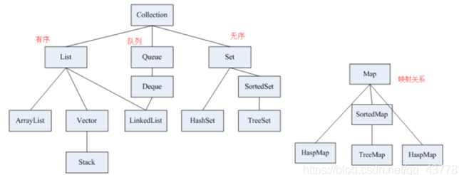
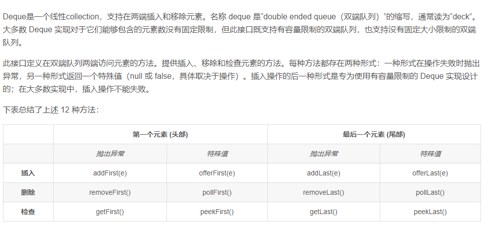

# 数组

```java
nums.length    //  求数组的长度
```

# Collection

```java
Collection的定义如下：
public interface Collection<E> extends Iterable<E> {}
基础API接口：

abstract boolean         add(E object)
abstract boolean         addAll(Collection<? extends E> collection)
abstract void            clear()
abstract boolean         contains(Object object)
abstract boolean         isEmpty()
abstract boolean         remove(Object object)
abstract boolean         removeAll(Collection<?> collection)
abstract int             size()
abstract <T> T[]         toArray(T[] array)
abstract Object[]        toArray()
```

## List

```java
List的定义如下：
public interface List<E> extends Collection<E> {}

// 相比与Collection，List新增的API：location 就是索引

abstract void                add(int location, E object)
abstract boolean             addAll(int location, Collection<? extends E> collection)
abstract E                   get(int location)
abstract int                 indexOf(Object object)     //获取对象的第一个索引
abstract int                 lastIndexOf(Object object) //获取对象的最后一个索引 
abstract E                   remove(int location)
abstract E                   set(int location, E object)
abstract List<E>             subList(int start, int end)
```

### ArrayList

```java
public class ArrayList<E> extends AbstractList<E> implements List<E>, RandomAccess, Cloneable, java.io.Serializable

```

ArrayList是一个动态数组，它允许任何符合规则的元素插入甚至包括null。每一个ArrayList都有一个初始容量：

```java
private static final int DEFAULT_CAPACITY = 10;
```

 ArrayList是线程不安全的，因此在并发编程时，经常会使用

Collections.synchronizedList  与  CopyOnWriteArrayList

来替代ArrayList，接下来对这两种list进行性能的比较。其中Collections.synchronizedLis在更新操作中使用了同步锁，而CopyOnWriteArrayList在更新操作中不仅使用了可重入锁，而且还需要进行数组的复制。

### LinkedList

LinkedList 是 Deque(Queue)的子类！！ 不要搞反）
LinkedList定义如下：

```java
Deque< TreeNode > que = new LinkedList<>();
que.isEmpty()       // 是否为空
que.offerFirst()     // 插入第一个元素
que.pollFirst()      //  删除第一个元素
que.peekFirst()     //     检查第一个元素
que.size();
```

```java
  线程安全版的  LinkedList     ConcurrentLinkedQueue
```


### Deque




# HashMap

```java
map.clear();
map.size();
map.isEmpty()
map.containsKey();判断
map.containsValue();
map.get(key);
map.put(key,value);
map.putAll(otherMap);
map.remove(key);

map.getOrDefault(key,defaultValue);查找key的值,不存在则返回默认值。

map.entrySet();用来遍历每一对KV
for(Map.Entry<Integer，Integer> etntey : map.entrySet())
Entry是Map集合类中的一个类，所以增强for的迭代类型是Map.Entry，并且是泛型是KV对，不要只写一个。
只要是Map，**泛型**就是一对。
```

```java
Map 接口没有提供 iterator() 方法，其子接口 Entry 提供了 iterator() 方法，并且提供了获取键、值的方法
    
    public static void main(String[] args) {
        Map<Integer, String> map = new HashMap<>();
        map.put(1, "xioaming");
        map.put(2, "xiao");
        map.put(3, "ming");
        map.put(4, "da");
//        遍历 map 里的所有元素集合
        for (Map.Entry<Integer, String> entry : map.entrySet()
        ) {
            Integer number = entry.getKey();
            String name = entry.getValue();
            System.out.println(number + "   " + name);
        }
//        只遍历   map  里面的    key
        for (Integer key : map.keySet()) {
            System.out.println(key);
        }
//       只遍历   map  里面的    value
        for (String name : map.values()
        ) {
            System.out.println(name);
        }
    }

```


# Set

```java
public void add(Object element) 
public boolean remove(object element) 
public boolean contains(Object o) 
   
```

HashSet

```java
Set<Character> seen = new HashSet<Character>();   
```

TreeSet

```java
TreeSet()// 默认构造函数。使用该构造函数，TreeSet中的元素按照自然排序进行排列。 
TreeSet(Comparator<? super E> comparator) // 指定TreeSet的比较器       
```


# String

```java
s = "name";
s.length();
s.charAt(index);
```

```java
public  substring(int beginIndex,int endIndex)
返回一个新字符串，它是此字符串的一个子字符串。该子字符串从指定的 beginIndex 处开始，一直到索引 endIndex - 1处的字符。因此，该子字符串的长度为 endIndex-beginIndex。
示例：
 "hamburger".substring(4, 8) returns "urge"
 "smiles".substring(1, 5) returns "mile"
参数：
beginIndex - 开始处的索引（包括）。
endIndex - 结束处的索引（不包括）。
返回：
指定的子字符串。
```

```java
java中  字符数组 与  字符串 的互转

String.valueOf(char[] ch)
    public static void main(String[] args) {
        //1.字符数组 转换成 字符串
        //(1)直接在构造String时转换
        char[] array = new char[] {'a','b','c','d','e','f','g'};
        String str = new String(array);
        System.out.println(str);
        
        //(2)调用String类的提供的方法的valueOf()
        String str2 = String.valueOf(array);
        System.out.println(str2);
        
        //2.字符串  转换成 字符数组 
        //(1)调用String类的提供的方法的toCharArray()
        String msg = "i am a good boy!";
        char[] dest = msg.toCharArray();
        System.out.println(Arrays.toString(dest));
    }
```


