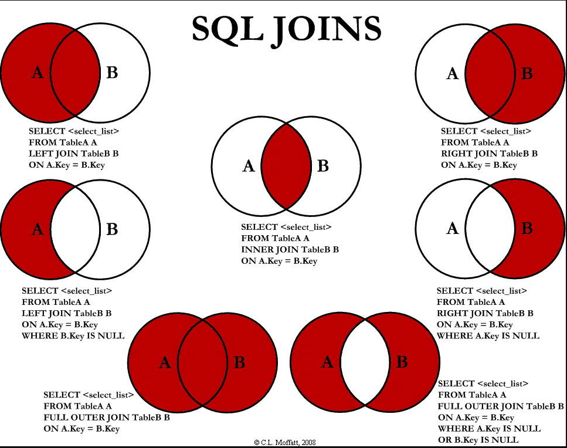
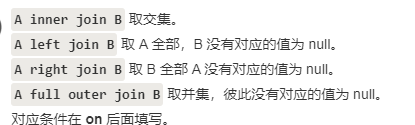
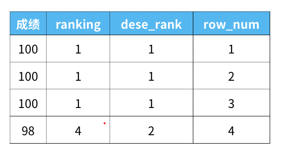

12.9

#### [182. 查找重复的电子邮箱](https://leetcode-cn.com/problems/duplicate-emails/)

```mysql
采用   Group by+Having  
select Email from Person group by Email having count(Email) > 1 
```

```mysql
采用   子查询
select Email from ( select Email ,count(Email) as num from Person group by Email ) as statistic where num>1
```


#### [175. 组合两个表](https://leetcode-cn.com/problems/combine-two-tables/)

[题解](https://leetcode-cn.com/problems/combine-two-tables/solution/tu-jie-sqlmian-shi-ti-duo-biao-ru-he-cha-xun-by-ho/)

```mysql
select p.FirstName, p.LastName, a.City, a.State from Person as p left join Address as a on p. PersonId = a. PersonId
```


表的连接问题，左连接，右连接。内连接





在left join 和right join的情况下，where 和on的作用情况是不同的。[on 和where的区别 ](https://blog.csdn.net/liitdar/article/details/80817957)  

#### [176. 第二高的薪水](https://leetcode-cn.com/problems/second-highest-salary/)

[猴子题解](https://leetcode-cn.com/problems/second-highest-salary/solution/tu-jie-sqlmian-shi-ti-ru-he-cha-zhao-di-ngao-de-sh/)

limit n子句表示查询结果返回前n条数据

offset n表示跳过x条语句

limit y offset x 分句表示查询结果跳过 x 条数据，读取前 y 条数据

```mysql
select ifnull( (select distinct Salary from Employee order by Salary desc limit 1 offset 1) ,null ) as SecondHighestSalary
```

#### [181. 超过经理收入的员工](https://leetcode-cn.com/problems/employees-earning-more-than-their-managers/)

```mysql
select a.Name as Employee from Employee as a   join  Employee as b on a.ManagerId = b.Id and a.Salary  > b.Salary
```

连接也可以连接两个相同的表

 [183. 从不订购的客户](https://leetcode-cn.com/problems/customers-who-never-order/)

```mysql
select customers.name as 'Customers'
from customers
where customers.id not in
(
    select customerid from orders
);
```

#### [196. 删除重复的电子邮箱](https://leetcode-cn.com/problems/delete-duplicate-emails/)

```mysql
DELETE p1 FROM Person p1, Person p2 WHERE p1.Email = p2.Email AND p1.Id > p2.Id
```

#### [197. 上升的温度](https://leetcode-cn.com/problems/rising-temperature/)

[不错的题解](https://leetcode-cn.com/problems/rising-temperature/solution/tu-jie-sqlmian-shi-ti-ru-he-bi-jiao-ri-qi-shu-ju-b/)

```mysql
--  SELECT
--     weather.id AS 'Id'
-- FROM
--     weather
--         JOIN
--     weather w ON DATEDIFF(weather.date, w.date) = 1
--         AND weather.Temperature > w.Temperature
```

## 12.13

#### [178. 分数排名](https://leetcode-cn.com/problems/rank-scores/)

```mysql
select Score  , dense_rank() over (order by Score desc) as 'Rank' from Scores 
-- Rank 为关键字，所以作为表名的时候，应该用引号括起来
```

专用窗口函数rank, dense_rank, row_number的区别    [猴子题解](https://leetcode-cn.com/problems/rank-scores/solution/tu-jie-sqlmian-shi-ti-jing-dian-pai-ming-wen-ti-by/)



#### [180. 连续出现的数字](https://leetcode-cn.com/problems/consecutive-numbers/)     

 [猴子题解](https://leetcode-cn.com/problems/consecutive-numbers/solution/tu-jie-mian-shi-ti-zhao-chu-lian-xu-chu-xian-nci-d/)

```mysql
select distinct a.Num as ConsecutiveNums from Logs as a ,Logs as b ,Logs as c where a.Id = b.Id -1 and b.Id = c.Id -1 and a.Num = b.Num and b.Num = c.Num
```

distinct  去除重复的元素

#### [ 查找最晚入职员工的所有信息](https://www.nowcoder.com/practice/218ae58dfdcd4af195fff264e062138f?tpId=82&&tqId=29753&rp=1&ru=/ta/sql&qru=/ta/sql/question-ranking)

注意题目中最晚入职的员工不一定只有一条记录

```mysql
select * from employees where hire_date = (select max(hire_date)  from  employees )
```

用limit不太合适

#### [ 查找入职员工时间排名倒数第三的员工所有信息](https://www.nowcoder.com/practice/ec1ca44c62c14ceb990c3c40def1ec6c?tpId=82&&tqId=29754&rp=1&ru=/ta/sql&qru=/ta/sql/question-ranking)

跟上一题一样，倒数第三的员工数量不一定只有一条

```mysql
select * from employees where  hire_date = (select distinct  hire_date from employees order by hire_date desc limit 1 offset 2) 
```

```mysql
limit 1 offset 2    # 表示  从偏移量为  2  的位置开始显示  1  条记录
```

####  [ 查找所有已经分配部门的员工的last_name和first_name](https://www.nowcoder.com/practice/6d35b1cd593545ab985a68cd86f28671?tpId=82&&tqId=29756&rp=1&ru=/ta/sql&qru=/ta/sql/question-ranking)

```mysql
select  distinct employees.last_name ,employees.first_name ,dept_emp.dept_no from employees ,dept_emp where employees.emp_no = dept_emp.emp_no
```

employees表中的dept_no有可能为NULL；但dep_emp表中的dept_no一定不为NULL，所以使用内部联结，去除dept_no为NULL的employees。

联结时，如果需要把dept_no=NULL的数据也列出，要使用外部联结 LEFT/RIGHT OUTER JOIN ... ON ...

#### [找出所有员工当前具体的薪水salary情况](https://www.nowcoder.com/practice/ae51e6d057c94f6d891735a48d1c2397?tpId=82&&tqId=29760&rp=1&ru=/ta/sql&qru=/ta/sql/question-ranking) 

```mysql
select distinct salary from salaries where to_date='9999-01-01' order by salary desc 
```

```mysql
select salary from salaries where to_date='9999-01-01' group by salary order by salary desc;
```

对于distinct与group by的使用：
1.当对系统的性能高并且数据量大时使用group by
2.当对系统的性能不高时或者使用数据量少时两者借口
3.尽量使用group by

#### [ 获取所有非manager的员工emp_no](https://www.nowcoder.com/practice/32c53d06443346f4a2f2ca733c19660c?tpId=82&&tqId=29762&rp=1&ru=/ta/sql&qru=/ta/sql/question-ranking)

```mysql
方法1：NOT IN+子查询
select emp_no from employees where emp_no not in (select emp_no from dept_manager);

方法2：LEFT JOIN左连接+IS NULL
SELECT e.emp_no FROM employees AS e LEFT JOIN dept_manager AS d ON e.emp_no=d.emp_no WHERE dept_no IS NULL;
```


#### [ 从titles表获取按照title进行分组](https://www.nowcoder.com/practice/72ca694734294dc78f513e147da7821e?tpId=82&&tqId=29765&rp=1&ru=/ta/sql&qru=/ta/sql/question-ranking)

```mysql
采用   Group by+Having   
select title,count(title) from titles   group by title having count(title) >= 2 

```

#### [ 查找employees表所有emp_no为奇数](https://www.nowcoder.com/practice/a32669eb1d1740e785f105fa22741d5c?tpId=82&&tqId=29767&rp=1&ru=/ta/sql&qru=/ta/sql/question-ranking)  

```mysql
select * from employees where emp_no % 2 =1 and last_name  <>'Mary'  order by hire_date desc
emp_no % 2 =1  表示奇数  
last_name  <>'Mary'   <>  表示不相等
补充  不相等有三种表示方式：<>、!=、IS NOT
```

#### [ 查找员工编号emp_now为10001其自入职以来的薪水salary涨幅值growth](https://www.nowcoder.com/practice/c727647886004942a89848e2b5130dc2?tpId=82&&tqId=29772&rp=1&ru=/ta/sql&qru=/ta/sql/question-ranking)

```mysql
select sum(s2.salary -s1.salary) from salaries s1 , salaries s2 where s1.emp_no = 10001 and s1.to_date = s2.from_date
```

## 12.14

#### [ 将employees表的所有员工的last_name和first_name拼接起来作为Name，中间以一个空格区分](https://www.nowcoder.com/practice/6744b90bbdde40209f8ecaac0b0516fe?tpId=82&&tqId=29800&rp=1&ru=/ta/sql&qru=/ta/sql/question-ranking)

```mysql
select concat(last_name," ",first_name) as name from employees
```

sql中的 concat 字符串拼接函数

#### [ 批量插入数据](https://www.nowcoder.com/practice/51c12cea6a97468da149c04b7ecf362e?tpId=82&&tqId=29802&rp=1&ru=/ta/sql&qru=/ta/sql/question-ranking)

```mysql
insert into actor(actor_id , first_name ,last_name,last_update ) values (1, "PENELOPE" ,  "GUINESS" , "2006-02-15 12:34:33"    ) ,(2,"NICK" ,"WAHLBERG" , "2006-02-15 12:34:33" )
```

#### [ 删除emp_no重复的记录，只保留最小的id对应的记录。](https://www.nowcoder.com/practice/3d92551a6f6d4f1ebde272d20872cf05?tpId=82&&tqId=29810&rp=1&ru=/ta/sql&qru=/ta/sql/question-ranking)

```mysql
delete from titles_test where id not in (select * from ( select min(id) from titles_test group by emp_no ) as a ) 
```

```mysql
MySQL的UPDATE或DELETE中子查询不能为同一张表，可将查询结果再次SELECT。 因为 像下面这样 写是不对的
delete from titles_test where id not in (select min(id) from titles_test group by emp_no)
会抛出如下异常
ERROR 1093 (HY000): You can't specify target table 'titles_test' for update in FROM clause
```

#### [将所有to_date为9999-01-01的全部更新为NULL,且 from_date更新为2001-01-01。](https://www.nowcoder.com/practice/859f28f43496404886a77600ea68ef59?tpId=82&&tqId=29811&rp=1&ru=/ta/sql&qru=/ta/sql/question-ranking)

```mysql
update titles_test set to_date = null ,from_date = "2001-01-01" where to_date = "9999-01-01"
# 基本的数据更新语法，UPDATE 表名称 SET 列名称 = 新值 WHERE 列名称 = 某值 
```

[ 将id=5以及emp_no=10001的行数据替换成id=5以及emp_no=10005,其他数据保持不变，使用replace实现。]()

#### [将titles_test表名修改为titles_2017](https://www.nowcoder.com/practice/5277d7f92aa746ab8aa42886e5d570d4?tpId=82&&tqId=29813&rp=1&ru=/ta/sql&qru=/ta/sql/question-ranking)   更改表名

```mysql
alter table titles_test rename to titles_2017
```

#### [ 出现三次以上相同积分的情况](https://www.nowcoder.com/practice/c69ac94335744480aa50646864b7f24d?tpId=82&&tqId=35079&rp=1&ru=/ta/sql&qru=/ta/sql/question-ranking)

```mysql
group by  + having  组合
select number from grade group by number having count(number) >=3
```

#### [ 找到每个人的任务](https://www.nowcoder.com/practice/9dd9182d029a4f1d8c1324b63fc719c9?tpId=82&&tqId=35081&rp=1&ru=/ta/sql&qru=/ta/sql/question-ranking)

```mysql
select a.id ,a.name ,b.content from person as a left join task  as b on  a.id = b.person_id
```

#### [ 牛客每个人最近的登录日期(一)](https://www.nowcoder.com/practice/ca274ebe6eac40ab9c33ced3f2223bb2?tpId=82&&tqId=35084&rp=1&ru=/ta/sql&qru=/ta/sql/question-ranking)

```mysql
   select user_id , max( date) from login  group by user_id  order by user_id
```

#### [ 考试分数(一)](https://www.nowcoder.com/practice/f41b94b4efce4b76b27dd36433abe398?tpId=82&&tqId=35492&rp=1&ru=/ta/sql&qru=/ta/sql/question-ranking)

```mysql
select job , round (avg(score) , 3 )  as "avg" from grade group by job order by  avg(score) desc
```

ROUND() 函数用于把数值字段舍入为指定的小数位数。

## 12.15

[ 查找各个部门当前领导当前薪水详情以及其对应部门编号dept_no](https://www.nowcoder.com/practice/c63c5b54d86e4c6d880e4834bfd70c3b?tpId=82&&tqId=29755&rp=1&ru=/ta/sql&qru=/ta/sql/question-ranking)

```mysql
select a.emp_no ,a.salary ,a.from_date,b.to_date , b.dept_no from salaries as a, dept_manager as b 
where a.emp_no = b.emp_no and b.to_date='9999-01-01' and a.to_date='9999-01-01' order by a.emp_no;
```

[ 查找所有员工的last_name和first_name以及对应部门编号dept_no](https://www.nowcoder.com/practice/dbfafafb2ee2482aa390645abd4463bf?tpId=82&&tqId=29757&rp=1&ru=/ta/sql&qru=/ta/sql/question-ranking)

```mysql
select a.last_name ,a.first_name ,b.dept_no from employees as a left join dept_emp as b on a.emp_no = b.emp_no
```

使用外部联结的左联结。**注意是大表（数据量多的）在前，**使用外连接

[ 查找所有员工入职时候的薪水情况](https://www.nowcoder.com/practice/23142e7a23e4480781a3b978b5e0f33a?tpId=82&&tqId=29758&rp=1&ru=/ta/sql&qru=/ta/sql/question-ranking)

```mysql
select employees.emp_no , salaries.salary from  salaries,  employees    where   salaries.emp_no = employees.emp_no and employees.hire_date = salaries.from_date order by employees.emp_no desc

```

[ 获取所有部门当前manager的当前薪水情况](https://www.nowcoder.com/practice/4c8b4a10ca5b44189e411107e1d8bec1?tpId=82&&tqId=29761&rp=1&ru=/ta/sql&qru=/ta/sql/question-ranking)

```mysql
select dept_manager.dept_no ,dept_manager.emp_no ,salaries.salary from dept_manager , salaries where dept_manager.emp_no = salaries.emp_no
and dept_manager.to_date='9999-01-01' and salaries.to_date='9999-01-01' order by dept_no
```

[ 获取所有员工当前的manager](https://www.nowcoder.com/practice/e50d92b8673a440ebdf3a517b5b37d62?tpId=82&&tqId=29763&rp=1&ru=/ta/sql&qru=/ta/sql/question-ranking)

```mysql
select a.emp_no ,b.emp_no from dept_emp as a , dept_manager as b where a.dept_no = b.dept_no   and a.emp_no != b.emp_no and  b.to_date='9999-01-01'
```

## 12.16

 [获取所有部门中当前员工薪水最高的相关信息](https://www.nowcoder.com/practice/4a052e3e1df5435880d4353eb18a91c6?tpId=82&&tqId=29764&rp=1&ru=/ta/sql&qru=/ta/sql/question-ranking)

```mysql
select d.dept_no , d.emp_no , s.salary  from dept_emp as d ,salaries as s where d.emp_no = s.emp_no and d.to_date = '9999-01-01'
and s.to_date='9999-01-01'  and s.salary = (select max(s1.salary) from dept_emp as d1 ,salaries as s1 where d1.emp_no = s1.emp_no and d1.to_date = '9999-01-01' and s1.to_date='9999-01-01' and d.dept_no = d1.dept_no ) order by d.dept_no
```

这道题比较难，应该用  关联子查询，外表固定一个部门，内表进行子查询

关键还有这句话    d.dept_no = d1.dept_no 

[ 从titles表获取按照title进行分组，注意对于重复的emp_no进行忽略。](https://www.nowcoder.com/practice/c59b452f420c47f48d9c86d69efdff20?tpId=82&&tqId=29766&rp=1&ru=/ta/sql&qru=/ta/sql/question-ranking)

```mysql
方法1：GROUPBY+HAVING，子查询，先去重再计数

SELECT title, COUNT(*) t FROM (SELECT DISTINCT emp_no,title FROM titles) GROUP BY title HAVING t>=2;
```

```mysql
 Distinct，考虑去重的部分中计数   group by + having 
 
 select titles.title ,count(distinct titles.emp_no ) as t from titles group by titles.title  having count(distinct titles.emp_no ) >= 2
```

```mysql
SELECT title, COUNT(DISTINCT emp_no) t FROM titles GROUP BY title HAVING t>=2;
```

[统计出当前各个title类型对应的员工当前薪水对应的平均工资](https://www.nowcoder.com/practice/c8652e9e5a354b879e2a244200f1eaae?tpId=82&&tqId=29768&rp=1&ru=/ta/sql&qru=/ta/sql/question-ranking)

```mysql
INNER JOIN( INNER JOIN 跟 , 是等价的 ) + GROUP BY

select t.title , avg(s.salary)  as 'avg' from salaries as s , titles as t where s.emp_no = t.emp_no and  t.to_date='9999-01-01'  and s.to_date='9999-01-01' group by t.title

注意：AVG(*)是自动命名为avg的，所以不用重命名
```


[ 获取当前薪水第二多的员工的emp_no以及其对应的薪水salary](https://www.nowcoder.com/practice/8d2c290cc4e24403b98ca82ce45d04db?tpId=82&&tqId=29769&rp=1&ru=/ta/sql&qru=/ta/sql/question-ranking)

```mysql
这种写法没有考虑到排名第二的员工数量不了一个  
select emp_no , salary from salaries where to_date='9999-01-01' order by salary desc limit 1 offset 1
```

```mysql
应该是这样的
select emp_no , salary from salaries where to_date='9999-01-01' and salary = 
(select salary from salaries where to_date='9999-01-01' group by salary order by salary desc limit 1 offset 1)
```

[ 查找当前薪水排名第二多的员工编号emp_no](https://www.nowcoder.com/practice/c1472daba75d4635b7f8540b837cc719?tpId=82&&tqId=29770&rp=1&ru=/ta/sql&qru=/ta/sql/question-ranking)

```mysql
select s.emp_no, s.salary, e.last_name, e.first_name
from salaries s join employees e
on s.emp_no = e.emp_no
where s.salary =              -- 第三步: 将第二高工资作为查询条件
    (
    select max(salary)        -- 第二步: 查出除了原表最高工资以外的最高工资(第二高工资)
    from salaries
    where salary <   
        (
        select max(salary)    -- 第一步: 查出原表最高工资
        from salaries
        where to_date = '9999-01-01'  
        )
    and to_date = '9999-01-01'
    )
and s.to_date = '9999-01-01'
```

```mysql
-- 方法二
select s.emp_no, s.salary, e.last_name, e.first_name
from salaries s join employees e 
on s.emp_no = e.emp_no
where s.salary =
    (
    select s1.salary
    from salaries s1 join salaries s2      -- 自连接查询
    on s1.salary <= s2.salary
    group by s1.salary                     -- 当s1<=s2链接并以s1.salary分组时一个s1会对应多个s2
    having count(distinct s2.salary) = 2   -- (去重之后的数量就是对应的名次)
    and s1.to_date = '9999-01-01'
    and s2.to_date = '9999-01-01'
    )
and s.to_date = '9999-01-01'
```


## 12.17


[ 查找所有员工的last_name和first_name以及对应的dept_name](https://www.nowcoder.com/practice/5a7975fabe1146329cee4f670c27ad55?tpId=82&&tqId=29771&rp=1&ru=/ta/sql&qru=/ta/sql/question-ranking)

```mysql
三表连接问题
select e.last_name , e.first_name , n.dept_name from employees as e left join (select d.emp_no ,d1.dept_name from dept_emp as d ,departments as d1 where d.dept_no = d1.dept_no ) as n on e.emp_no = n.emp_no

```

[ 查找所有员工自入职以来的薪水涨幅情况](https://www.nowcoder.com/practice/fc7344ece7294b9e98401826b94c6ea5?tpId=82&&tqId=29773&rp=1&ru=/ta/sql&qru=/ta/sql/question-ranking)

解题要领：**构建现在的工资表和入职的工资表**，**然后做差**
隐含题意：现在对应的时间是to_date=‘9999-01-01’，入职则需要利用employees表的hire_date字段

方法1：利用左外连接创建Scurrent表和Sstart表  

```mysql

select s1.emp_no,(s1.salary-e1.salary) as growth
from
# 查询当前工资
(select emp_no,salary
from salaries
where to_date='9999-01-01') as s1
# 内连接2次查询结果
inner join
# 查询入职时候的工资
(select s.emp_no,s.salary
from salaries as s
inner join employees as e
on s.emp_no = e.emp_no and s.from_date=e.hire_date) as e1
 
on s1.emp_no=e1.emp_no
order by growth
```


[]()

[]()

[]()

[]()

[]()

[]()


