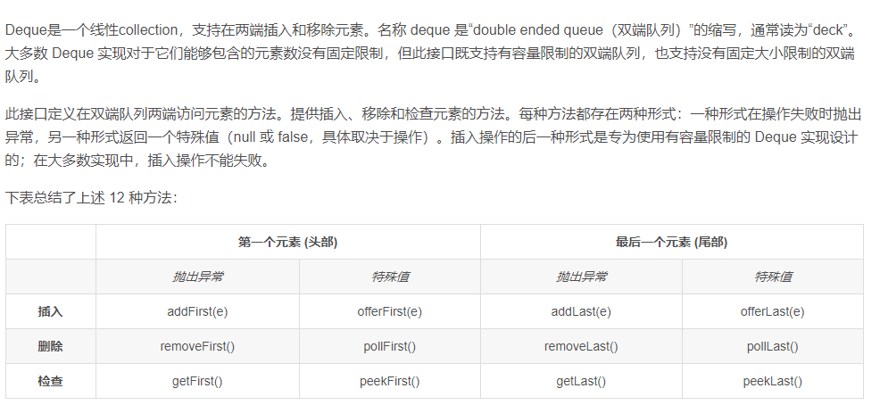

# 回溯算法  

[46. 全排列](https://leetcode-cn.com/problems/permutations/)

[22. 括号生成](https://leetcode-cn.com/problems/generate-parentheses/)

在22的括号生成那里， **for 选择 in 选择列表:**   有了对动作判断的部分  。46全排列是没有对动作判断的过程。

```python
class Solution:  
    def generateParenthesis(self, n: int) -> List[str]:  
        res = []
        def dfs(path,left,right) :  
            if len(path) == 2*n:
                res.append( ''.join(path) )
            for ch in ['(' , ')']:
                if ch == '('  and right  < n :
                    path.append(ch)
                    dfs(path,left,right+1)
                    path.pop()
                if ch == ')'  and right  > left :
                    path.append(ch)
                    dfs(path,left+1,right)
                    path.pop()
                    
        dfs( [] , 0 , 0)
        return res
```


[看的这个回溯算法](https://labuladong.gitbook.io/algo/suan-fa-si-wei-xi-lie/3.1-hui-su-suan-fa-dfs-suan-fa-xi-lie/hui-su-suan-fa-xiang-jie-xiu-ding-ban)


```python
#模板
def backtrack(路径, 选择列表):
    if 满足结束条件:
        result.add(路径)
        return

    for 选择 in 选择列表:
        做选择
        backtrack(路径, 选择列表)
        撤销选择
```

# 双指针

## 滑动窗口 

[239. 滑动窗口最大值](https://leetcode-cn.com/problems/sliding-window-maximum/) 

```python
class Solution:
    def maxSlidingWindow(self, nums: List[int], k: int) -> List[int]:
        res = []
        deque = []
        if not nums and k==0:
            return []
        for i in range(k):
            while deque and deque[-1]<nums[i]:
                deque.pop()
            deque.append(nums[i])
        res.append(deque[0])

        for i in range(k,len(nums)):
            if deque[0] == nums[i-k]:
                deque.pop(0)
            while deque and deque[-1]<nums[i]:
                deque.pop()
            deque.append(nums[i])
            res.append(deque[0])
        return res
```
[3. 无重复字符的最长子串](https://leetcode-cn.com/problems/longest-substring-without-repeating-characters/)  

```python
class Solution:
    def lengthOfLongestSubstring(self, s: str) -> int:
        if not s:
            return 0
        seen = set()
        left = 0
        right = 0
        res = 0
        while right < len(s) :       
            print(seen)
            while s[right] in seen :             
                seen.remove(s[left])
                left += 1
            res = max( res,right - left + 1 )
            seen.add(s[right])
            right += 1
        return res
```


[76. 最小覆盖子串](https://leetcode-cn.com/problems/minimum-window-substring/)  
这两道题一个是求最长，一个求最短，代码区别在于第二个while那里的判断条件。

# 

## 两边往中间走 

如 [167. 两数之和 II - 输入有序数组](https://leetcode-cn.com/problems/two-sum-ii-input-array-is-sorted/) ， [977. 有序数组的平方](https://leetcode-cn.com/problems/squares-of-a-sorted-array/)   

## 从同一边出发 

[26. 删除排序数组中的重复项](https://leetcode-cn.com/problems/remove-duplicates-from-sorted-array/)

```python
class Solution:
    def removeDuplicates(self, nums: List[int]) -> int:
        if len(nums) == 0 :
            return 0
        i = 0
        for j in range(1,len(nums)) :
            if nums[i] != nums[j] :
                i += 1
                nums[i] = nums[j] 
        return i + 1  
```


## 从两个数组末尾往前面走

 [面试题 10.01. 合并排序的数组](https://leetcode-cn.com/problems/sorted-merge-lcci/)

## 环形链表问题

以下问题除了常规的set()方法，时间复杂度 *O*(log*n*)  ， 空间复杂度： *O*(log*n*)

还有快慢指针方法。

[141. 环形链表](https://leetcode-cn.com/problems/linked-list-cycle/)

[142. 环形链表 II](https://leetcode-cn.com/problems/linked-list-cycle-ii/)

[287. 寻找重复数](https://leetcode-cn.com/problems/find-the-duplicate-number/)  

[202. 快乐数](https://leetcode-cn.com/problems/happy-number/)


# 二叉树的 前 中 后 层 序遍历  

[帅地教程](https://github.com/iamshuaidi/algo-basic/tree/master/%E5%AD%A6%E7%AE%97%E6%B3%95/%E6%90%9E%E5%AE%9A%E4%BA%8C%E5%8F%89%E6%A0%91)  
自己写的代码

```java
双端队列(两端都可进出)
Deque<TreeNode> stk = new LinkedList<TreeNode>();
List<Integer> res = new ArrayList<Integer>();
```



### 前序迭代

``` python
#   采用一个栈来辅助    非递归的解法   
class Solution:      
    def preorderTraversal(self, root: TreeNode) -> List[int]:    
        stack = []
        output = []
        stack.append(root)
        if not root:
            return output
        while  stack : 
            root = stack.pop()             # 用   的   是  栈
            output.append(  root.val  )
            if root.right:
                stack.append(root.right)
            if root.left:
                stack.append(root.left)
        return output
```
### 中序迭代

``` python
class Solution:
    def inorderTraversal(self, root: TreeNode) -> List[int]:
        res = []
        stack   = []
        if not root :
            return res
        
        while root or stack : 
            if root : 
                stack.append(root)
                root = root.left
            else :
                root = stack.pop()               #   用的是栈
                res.append(root.val)
                root = root.right
        return res
```

```java
class Solution {
    public List<Integer> inorderTraversal(TreeNode root) {
        Deque<TreeNode> stack = new LinkedList<TreeNode>();
        List<Integer > res = new LinkedList<Integer>();
        if(root == null){
            return new LinkedList<Integer>();
        }
        while(root != null  || !stack.isEmpty()){
            if(root  != null){
                stack.addLast(root);
                root = root.left;
            }else{
                root = stack.removeLast();
                res.add(root.val);
                root = root.right;
            }
        }
        return res;
    }
}
```


### 后序迭代

``` python
class Solution:
    def postorderTraversal(self, root: TreeNode) -> List[int]: 
        res = []
        stack = []
        if not root :
            return res
        stack.append(root)
        while stack :
        # if 1 : 
            temp = stack.pop()
            res.insert(0,temp.val)           #   特别的地方
            # res.append(temp.val)
            if temp.left :   
                stack.append(temp.left )
            if temp.right :
                stack.append(temp.right )
        return res
```


### 前序递归

```python
class Solution:
    def preorderTraversal(self, root: TreeNode) -> List[int]:
        res = []
        def preorder(root):
            if not root:
                return
            res.append(root.val)
            preorder(root.left)
            preorder(root.right)
        preorder(root)
        return res
```
### 中序递归
``` python
class Solution:
    def inorderTraversal(self, root: TreeNode) -> List[int]:
        res = []
        def minoder( T     ) :
            if not T :
                return 
            minoder( T.left    )
            res.append(T.val)   
            minoder(T.right    )
        minoder( root)
        return res
```
### 后序递归
``` python
class Solution:
    def postorderTraversal(self, root: TreeNode) -> List[int]:
        res = []
        def post (T) :
            if  not T :  
                return   
            post(T.left)   
            post(T.right)  
            res.append(T.val)
            return 
        post(root)
        return res
```
### 层序遍历
```python
class Solution:
    def levelOrder(self, root: TreeNode) -> List[List[int]]:
        res = []
        level = []
        result = []
        if not root :
            return result 
        res.append(root)
        while res:
            level = []
            for i in range(len(res)):
                root = res.pop(0)                  #   这里用的是  队列
                level.append(root.val)
                if root.left:
                    res.append(root.left)
                if root.right:
                    res.append(root.right)
            result.append(level)

        return result
```

# 二分查找  

排序数组中的搜索问题，首先想到 二分法 解决

[拉布拉多(但是有人在喷这个题解。。。)](https://github.com/labuladong/fucking-algorithm/blob/master/%E7%AE%97%E6%B3%95%E6%80%9D%E7%BB%B4%E7%B3%BB%E5%88%97/%E4%BA%8C%E5%88%86%E6%9F%A5%E6%89%BE%E8%AF%A6%E8%A7%A3.md)  

[另一个题解](https://leetcode-cn.com/problems/find-first-and-last-position-of-element-in-sorted-array/solution/da-jia-bu-yao-kan-labuladong-de-jie-fa-fei-chang-2/)  

### 普通的查找 target 出现的位置  
```python
class Solution:
    def search(self, nums: List[int], target: int) -> int:
        left = 0
        right = len(nums) - 1 
        while left<=right:
            mid = left + (right-left) //2
            if nums[mid]==target:
                return mid
            elif nums[mid] > target:
                right = mid - 1
            else :
                left = mid +1
        return -1
```
###  查找 target 出现的第 1 个位置
```python
private int findFirstPosition(int[] nums, int target) {
    int left = 0;
    int right = nums.length - 1;

    while (left <= right) {
        int mid = left + (right - left) // 2;

        if (nums[mid] == target) {
            // ① 不可以直接返回，应该继续向左边找，即 [left, mid - 1] 区间里找
            right = mid - 1;
        } else if (nums[mid] < target) {
            // 应该继续向右边找，即 [mid + 1, right] 区间里找
            left = mid + 1;
        } else {
            // 此时 nums[mid] > target，应该继续向左边找，即 [left, mid - 1] 区间里找
            right = mid - 1;
        }
    }

    // 此时 left 和 right 的位置关系是 [right, left]，注意上面的 ①，此时 left 才是第 1 次元素出现的位置
    // 因此还需要特别做一次判断
    if (left != nums.length && nums[left] == target) {
        return left;
    }
    return -1;
}

```
###  查找 target 出现的最后 1 个位置
```python
    private int findLastPosition(int[] nums, int target) {
        int left = 0;
        int right = nums.length - 1;

        while (left <= right) {
            int mid = left + (right - left) / 2;

            if (nums[mid] == target) {
                // 只有这里不一样：不可以直接返回，应该继续向右边找，即 [mid + 1, right] 区间里找
                left = mid + 1;
            } else if (nums[mid] < target) {
                // 应该继续向右边找，即 [mid + 1, right] 区间里找
                left = mid + 1;
            } else {
                // 此时 nums[mid] > target，应该继续向左边找，即 [left, mid - 1] 区间里找
                right = mid - 1;
            }
        }

        if (right != -1 && nums[right] == target) {
            return right;
        }
        return -1;
    }
```

#### [34. 在排序数组中查找元素的第一个和最后一个位置](https://leetcode-cn.com/problems/find-first-and-last-position-of-element-in-sorted-array/)    前两个题对应的题目

#### [剑指 Offer 53 - I. 在排序数组中查找数字 I ](https://leetcode-cn.com/problems/zai-pai-xu-shu-zu-zhong-cha-zhao-shu-zi-lcof/)    统计一个数字在排序数组中出现的次数。


## 旋转数组中查找

### [33. 搜索旋转排序数组](https://leetcode-cn.com/problems/search-in-rotated-sorted-array/)

主要判断左右边界点跟mid的位置关系 ，因为左右边界节点数组是有序的    （本题是     在     没有重复数字      数组      中找特定的值）

```python
class Solution:
    def search(self, nums: List[int], target: int) -> int:  
        left = 0  
        right = len(nums) -1 
        while left <= right :
            mid = left + (right - left) // 2 
            if nums[mid] == target :
                return mid
            if nums[0] <= nums[mid] :
                if nums[0] <= target < nums[mid] :
                    right = mid -1 
                else:
                    left = mid + 1 
            else:
                if nums[mid] < target <= nums[-1] :
                    left = mid +1
                else:
                    right = mid -1
        return -1
 
```

```python
class Solution:
    def search(self, nums: List[int], target: int) -> bool:
        left = 0
        right = len(nums) - 1
        while left <= right :
            mid = left + (right - left ) // 2
            if nums[mid] == target :
                return True
        #    从判断   nums[mid] 与 nums[left]   的大小关系就是缩小范围   的开始
            if nums[mid] == nums[left] :
                left += 1
            elif nums[mid] > nums[left] :
                if nums[mid] > target >= nums[left] :
                    right = mid - 1
                else:
                    left = mid + 1
            else:
                if nums[mid] < target <= nums[right] :
                    left = mid + 1
                else:
                    right = mid - 1
        #       从判断   nums[mid] 与 nums[left]   的大小关系就是缩小范围   的结束
        return False
```


### [81. 搜索旋转排序数组 II](https://leetcode-cn.com/problems/search-in-rotated-sorted-array-ii/)

跟33的区别就是旋转数组中有了重复元素

```python
class Solution: 
    def search(self, nums: List[int], target: int) -> bool: 
        if not nums:
            return False
        left = 0
        right = len(nums) - 1
        while left <= right : 
            mid =left + (right - left ) // 2
            if nums[mid] == target:
                return True
            if nums[left] == nums[mid] :  
                left += 1  
                continue
            if nums[left] < nums[mid] :  
                if nums[left] <= target < nums[mid] :     # nums[left] <= target  等号很重要
                    right = mid - 1
                else:
                    left = mid + 1
            else:
                if nums[mid] < target <= nums[right] :    # target <= nums[right]  等号很重要
                    left = mid + 1
                else:
                    right = mid - 1
        return False
```


### [153. 寻找旋转排序数组中的最小值](https://leetcode-cn.com/problems/find-minimum-in-rotated-sorted-array/)

```python
class Solution:
    def findMin(self, nums: List[int]) -> int:
        if len(nums) == 1:
            return nums[0]
        if nums[-1] > nums[0] :
            return nums[0]

        left = 0
        right = len(nums) - 1 
        while left <= right :
            mid = left + (right - left ) // 2 
            if nums[mid] > nums[mid + 1] :
                return nums[mid + 1]
            if nums[mid - 1 ] > nums[mid ] :
                return nums[mid ]
            if nums[mid] > nums[0] :
                left = mid + 1 
            else :
                right = mid - 1 
```

```python
class Solution:                                        #  这种题解更好理解一点
    def findMin(self, nums: List[int]) -> int:
        left = 0
        right = len(nums) - 1
        while left < right :
            mid = left + (right - left ) // 2
            if nums[mid] > nums[mid + 1] :
                return nums[mid + 1]
            if nums[mid - 1 ] > nums[mid ] :
                return nums[mid ]

            if nums[mid] > nums[right] :
                left = mid + 1
            else : 
                right = mid 
        return nums[left]
```


### [154. 寻找旋转排序数组中的最小值 II](https://leetcode-cn.com/problems/find-minimum-in-rotated-sorted-array-ii/)

[寻找旋转排序数组中的最小值 II    不错的题解](https://leetcode-cn.com/problems/find-minimum-in-rotated-sorted-array-ii/solution/tong-guo-hua-tu-lai-shen-ke-li-jie-er-fen-fa-by-ch/)

```python
class Solution:
    def findMin(self, nums: List[int]) -> int:
        left = 0
        right = len(nums) - 1
        while left < right :
            mid = left + (right - left ) // 2
            if nums[mid] > nums[right] :
                left = mid + 1
            elif nums[mid] < nums[right] :
                right = mid 
            else:
                right -= 1
        return nums[left]
```


## 山峰数组中查找

### [1095. 山脉数组中查找目标值](https://leetcode-cn.com/problems/find-in-mountain-array/)

先找到中间山峰的地方，然后再左边和右边二分查找

```python
# """
# This is MountainArray's API interface.
# You should not implement it, or speculate about its implementation
# """
#class MountainArray:
#    def get(self, index: int) -> int:
#    def length(self) -> int:

class Solution:
    def findInMountainArray(self, target: int, mountain_arr: 'MountainArray') -> int:

        Length = mountain_arr.length()  
        left = 0 
        right = Length - 1  
        
        while left <= right:
            mid = left + (right - left ) // 2  
            print("left",left,"right",right,"mid" , mid)
            temp_l = mountain_arr.get(mid-1 ) 
            temp = mountain_arr.get(mid)
            temp_r = mountain_arr.get(mid+1)
            if  temp_l  < temp  and temp > temp_r :  
                break 
            elif temp_l  <temp  and temp < temp_r  :
                left = mid+1
            else:
                right = mid  # 这个地方有点特别   并不是一般的 right = mid - 1 

        def find_left(mid):
            left = 0
            right = mid
            while left <= right :
                mid = left + (right - left ) // 2
                temp = mountain_arr.get(mid)
                if temp == target :
                    return mid
                elif temp < target:
                    left = mid +1 
                else:
                    right = mid -1
            return -1
        
        def find_right(mid):
            left = mid
            right = Length - 1
            while left <= right :
                mid = left + (right - left ) // 2
                temp = mountain_arr.get(mid)
                if temp == target :
                    return mid
                elif temp < target:
                    right = mid -1
                else:
                    left = mid + 1
            return -1
        res = find_left(mid)
        if res == -1:
            res = find_right(mid)
        return res
```

### [852. 山脉数组的峰顶索引](https://leetcode-cn.com/problems/peak-index-in-a-mountain-array/)

```python
class Solution:
    def peakIndexInMountainArray(self, arr: List[int]) -> int:
        left = 0
        right = len( arr )
        while left <= right :
            mid = left + (right -left) // 2
            print(left,right,mid)
            if arr[mid-1] < arr[mid] and arr[mid] > arr[mid+1] :
                return mid
            if arr[mid-1] < arr[mid]  :
                left = mid + 1
            else:
                right = mid   #  这里跟之前的不太一样
```


[剑指 Offer 04. 二维数组中的查找](https://leetcode-cn.com/problems/er-wei-shu-zu-zhong-de-cha-zhao-lcof/)

二维数组的查找，但时间复杂度是O(m+n)  ，实际这道题除了左上角还有右小角可以选择

# 动态规划

[看的是帅地教程](https://github.com/iamshuaidi/algo-basic/blob/master/%E5%AD%A6%E7%AE%97%E6%B3%95/%E5%AD%A6%E5%8A%A8%E6%80%81%E8%A7%84%E5%88%92/%E5%8A%A8%E6%80%81%E8%A7%84%E5%88%92%E5%BE%88%E9%9A%BE%EF%BC%9FDP%E8%BF%9E%E5%88%B740%E9%81%93%E9%A2%98%EF%BC%8C%E6%88%91%E6%80%BB%E7%BB%93%E5%87%BA%E4%BA%86%E8%BF%99%E4%BA%9B%E5%A5%97%E8%B7%AF.md)

# 并查集，解决图之类连通性问题  

代码模板，对应leetcode 547朋友圈的题
```python
class UF:
    count = 0    # 连通分量的个数
    parent = []  # 存储一课数
    size = []    # 记录树的重量

    def __init__(self, n):
        self.count = n
        self.parent = [i for i in range(n)]
        self.size = [i for i in range(n)]

    def union(self,p,q):
        rootP = self.find(p)
        rootQ = self.find(q)
        if rootP == rootQ:
            return 
        #小树接到大树下面，较平衡
        if self.size[rootP]  < self.size[rootQ] :
            self.parent[rootQ] =  rootP
            self.size[rootP] += self.size[rootQ]
        else:
            self.parent[rootP] =  rootQ
            self.size[rootQ] += self.size[rootP]
        self.count-=1


    def connected( self,p,q):
        return find(p)==find(q)

    def find(self, x):
        while self.parent[x]!=x:
            self.parent[x] = self.parent[self.parent[x]]   #   这一步是路径压缩了   这样树的高度最后将不会高于3   但是也损失了路径信息  所以应该根据实际选择
            x = self.parent[x]
        return x
    
    def getCount(self):
        return self.count


class Solution:
    def findCircleNum(self, M: List[List[int]]) -> int:
        uf = UF(len(M))
        for i in range(len(M)):
            for j in range(i,len(M)):
                if M[i][j] == 1 :
                    uf.union(i,j)

        res = uf.getCount()
        return res
```

