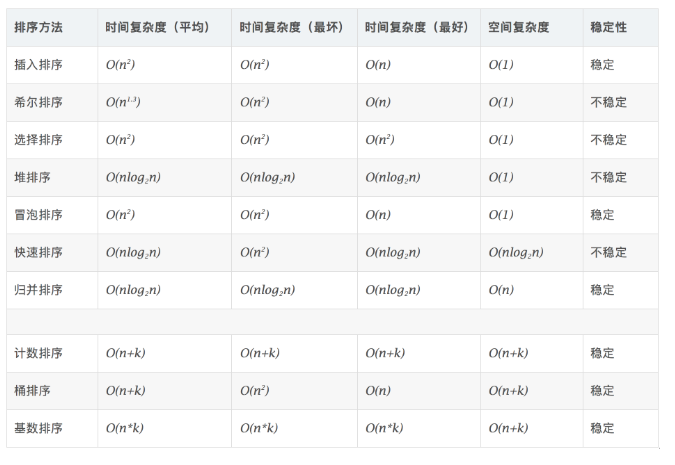

#### [912. 排序数组](https://leetcode-cn.com/problems/sort-an-array/)

对应的做练习的地方



# 冒泡排序

```python
def swap(i,j):
            temp = num[i]
            num[i] = num[j]
            num[j] = temp
        for i in range(len(num)):      
            for j in range(len(num)-i-1):  
                if num[j] > num[j+1] :   
                    swap(j,j+1)          
```

